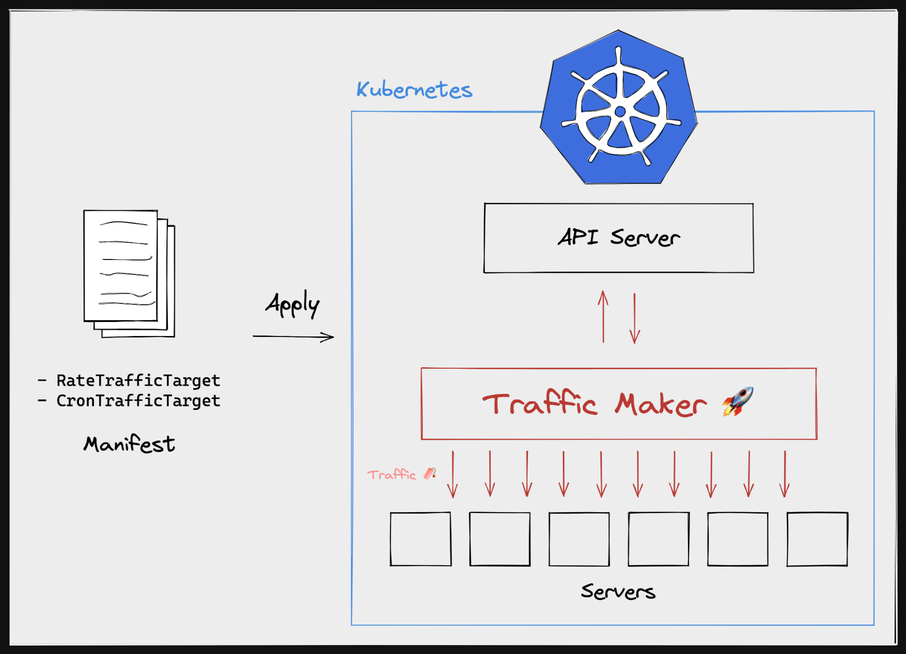

# Traffic Maker

   



Artificial Traffic Maker Operator for Kubernetes


## Why need

Useful when traffic is required in a Kubernetes environment

There is an example as follows.
- Traffic is required to create a virtual production environment
- Traffic is required for simple performance testing
- Periodic traffic is required (cron)

## License

```xml
Designed and developed by 2022 KimDoubleB (Bobae Kim)

Licensed under the Apache License, Version 2.0 (the "License");
you may not use this file except in compliance with the License.
You may obtain a copy of the License at

   http://www.apache.org/licenses/LICENSE-2.0

Unless required by applicable law or agreed to in writing, software
distributed under the License is distributed on an "AS IS" BASIS,
WITHOUT WARRANTIES OR CONDITIONS OF ANY KIND, either express or implied.
See the License for the specific language governing permissions and
limitations under the License.
```